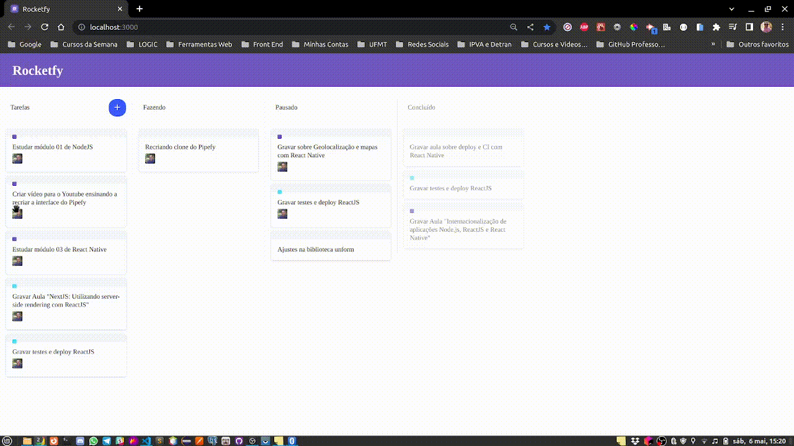
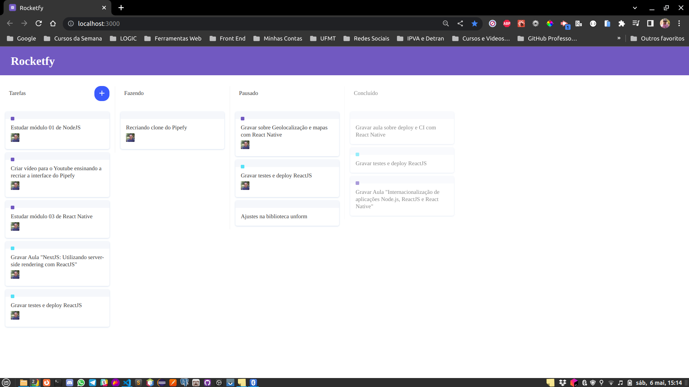

<h1 align="center">
  
  
</h1>

<div align="center">
  <a href="#-projeto">Projeto</a>&nbsp;&nbsp;&nbsp;|&nbsp;&nbsp;&nbsp;
  <a href="#-tecnologias">Tecnologias</a>&nbsp;&nbsp;&nbsp;|&nbsp;&nbsp;&nbsp;
  <a href="#-licença">Licença</a>&nbsp;&nbsp;&nbsp;|&nbsp;&nbsp;&nbsp;
  <a href="#-autor">Autor</a>
</div>

<br>

<p align="center">
  
  
  
</p>

<br>

## 💻 Projeto

Este projeto consiste em um clone do Pipefy, com ele podemos gerenciar nossos projetos e automatizar nossos fluxos de trabalho.
<br>
Neste projeto foi utilizado o conceito drag and drop (Arastar e soltar) para criar cada card de tarefa e podermos movimentá-lo pelas listas.
<br>

### Dashboard Gif

<p align="center">
    
</p>
<br>

### Dashboard

<p align="center">
    
</p>

<br>

### Dashboard Vídeo

<p align="center">
    <video src=".github/rocketfy.mp4" autoplay>
      Desculpa, o seu navegador não suporta vídeos incorporados.
    </video>
</p>
<br>

## 🚀 Tecnologias

Esse projeto foi desenvolvido com as seguintes tecnologias e ferramentas:

<div align="center">

  
  
  
  
  
  
  
  
</div>

<br>

## 🔥 Executar Aplicação

### 🎇 Executando Localmente a Aplicação

Caso você deseja executar o projeto na sua máquina local, você precisará instalar o Node.js 16.\* em sua máquina. Após a instalação, basta seguir os passos abaixo:

### 🌀 Começando...

Para começar, você deve simplesmente clonar o repositório do projeto na sua máquina.

Navegue até o local onde você clonou o projeto, exemplo:

```sh
C:\Users\NomeDoComputador\Documents\CloneDoProjeto
```

#### ❗️ Instalando as Dependências (via Windows):

Bom, agora que clonou o projeto **(dentro da pasta `rocketfy-drag-and-drop` do projeto clonado abra um terminal)**. Agora basta digitar no cmd a seguinte instrução:

```sh
npm install
```

ou

```sh
yarn install
```

Ao digitar a instrução acima, automaticamente ele irá baixar todas as dependências listadas e definidas no arquivo package.json:

### 🛰️ Executando o projeto

Após baixar todas as dependências é só digitar no terminal a instrução abaixo:

```sh
npm run start
```

ou

```sh
yarn start
```

Pronto! dessa forma o projeto `rocketfy-drag-and-drop` estará rodando localmente em sua maquina. Acesse no navegador o endereço abaixo:

```sh
http://localhost:3000
```

<br>

## 🚩 Tenho Dúvidas... O que fazer?

Caso tenha dúvidas sobre o código do projeto, sintam-se a vontade em abrir uma **[ISSUE AQUI](https://github.com/Wanderson-A-Timoteo/rocketfy-drag-and-drop/issues)**. Assim que possível, responderei todas as dúvidas!

<br>

## 💡 Licença

Esse projeto está sob a licença MIT. Veja o arquivo [LICENSE](.github/LICENSE.md) para mais detalhes.

<br>

## 🎆 Autor

Feito com ♥ by

[<br><sub>Wanderson A. Timóteo</sub>](https://www.wandersontimoteo.ga/)

<br>

## 🤝 Agradecimentos

<p align="center">
    
</p>
<br>

Projeto desenvolvido assistindo a vídeo aula no canal da [Rocketseat](https://www.youtube.com/watch?v=awRtgpRsdTQ) no YouTube.

Agradecimento ao [Diego Fernandes](https://www.instagram.com/dieegosf/) por compartilhar conteúdo relevante e com qualidade de ensino.
